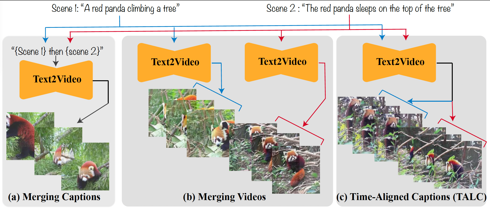

# TALC: Time-Aligned Captions for Multi-Scene Text-to-Video Generation

[[Paper]](https://arxiv.org/abs/2405.04682)  [[Website]](https://talc-mst2v.github.io) [[Dataset]](https://huggingface.co/datasets/hbXNov/multi_scene_video_text_data/tree/main)   [[Checkpoint]](https://huggingface.co/hbXNov/talc_finetuned_modelscope_t2v)

<h1 align="center"></h1>

## Abstract
Recent advances in diffusion-based generative modeling have led to the development of text-to-video (T2V) models that can generate high-quality videos conditioned on a text prompt. Most of these T2V models often produce single-scene video clips that depict an entity performing a particular action (e.g., 'a red panda climbing a tree'). However, it is pertinent to generate multi-scene videos since they are ubiquitous in the real-world (e.g., 'a red panda climbing a tree' followed by `the red panda sleeps on the top of the tree'). To generate multi-scene videos from the pretrained T2V model, we introduce \textbf{T}ime-\textbf{Al}igned \textbf{C}aptions (\name) framework. Specifically, we enhance the text-conditioning mechanism in the T2V architecture to recognize the temporal alignment between the video scenes and scene descriptions. For instance, we condition the visual features of the earlier and later scenes of the generated video with the representations of the first scene description (e.g., 'a red panda climbing a tree') and second scene description (e.g., 'the red panda sleeps on the top of the tree'), respectively. As a result, we show that the T2V model can generate multi-scene videos that adhere to the multi-scene text descriptions and be visually consistent (e.g., entity and background). Further, we finetune the pretrained T2V model with multi-scene video-text data using the \name framework. We show that the \name-finetuned model outperforms the baseline methods by 15.5 points in the overall score, which averages visual consistency and text adherence using human evaluation. 

## Examples

<table class="center">
Scene 1: Superman is surfing on the waves.Scene 2: The Superman falls into the water.
  <td></td>
  <td></td>
  <tr>
  <td style="text-align:center;" width="320">Baseline (Merging Captions)</td>
  <td style="text-align:center;" width="320">TALC (Ours)</td>
  <tr>
</table>
<table class="center">
Scene 1: Spiderman is surfing on the waves.
Scene 2: Darth Vader is surfing on the same waves.
  <td></td>
  <td></td>
  <tr>
  <td style="text-align:center;" width="320">Baseline (Merging Captions)</td>
  <td style="text-align:center;" width="320">TALC (Ours)</td>
  <tr>
</table>
<table class="center">
Scene 1: A stuffed toy is lying on the road.
Scene 2: A person enters and picks the stuffed toy.
  <td></td>
  <td></td>
  <tr>
  <td style="text-align:center;" width="320">Baseline (Merging Captions)</td>
  <td style="text-align:center;" width="320">TALC (Ours)</td>
  <tr>
</table>
<table class="center">
Scene 1: Red panda is moving in the forest.
Scene 2: The red panda spots a treasure chest.
Scene 3: The red panda finds a map inside the treasure chest.
  <td></td>
  <td></td>
  <tr>
  <td style="text-align:center;" width="320">Merging Captions</td>
  <td style="text-align:center;" width="320">TALC (Ours)</td>
  <tr>
</table>
<table class="center">
Scene 1: A koala climbs a tree.
Scene 2: The koala eats the eucalyptus leaves.
Scene 3: The koala takes a nap.
  <td></td>
  <td></td>
  <tr>
  <td style="text-align:center;" width="320">Merging Captions</td>
  <td style="text-align:center;" width="320">TALC (Ours)</td>
  <tr>
</table>


## Installation

1. Creating conda environment

```
conda create -n talc python=3.10
conda activate talc
```

2. Install Dependencies
```
pip install -r requirements.txt
conda install -c menpo opencv
```

## Inference
1. We provide a sample command to generate multi-scene (n = 2) videos from the base ModelScopeT2V model using the TALC framework. 
```python
CUDA_VISIBLE_DEVICES=0 python inference.py --outfile test_scene.mp4 --model-name-path damo-vilab/text-to-video-ms-1.7b --talc --captions "koala is climbing a tree." "kangaroo is eating fruits."
```
2. In the above command, replacing `--talc` with `--merge` will generate different video scenes for individual captions and output a merged video.
3. To perform inference using the merging captions method, you can use:
```python
CUDA_VISIBLE_DEVICES=0 python inference.py --outfile test_scene.mp4 --model-name-path damo-vilab/text-to-video-ms-1.7b --captions "koala is climbing a tree." "kangaroo is eating fruits."
```
4. To generate multi-scene videos using the TALC-finetuned model, the command is:
```python
CUDA_VISIBLE_DEVICES=4 python inference.py --outfile test_scene.mp4 --model-name-path talc_finetuned_modelscope_t2v --talc --captions --captions "spiderman surfing in the ocean." "darth vader surfing in the ocean."
```
5. In essense, we make changes to [pipeline_text_to_video_synth.py](diffusers/pipelines/text_to_video_synthesis/pipeline_text_to_video_synth.py) to support TALC framework.

## Data

### Task Prompts (4 scenes)
1. Single characters under multiple visual context - [file](prompts/single_character_multiple_context.json)
2. Different characters, single context - [file](prompts/different_characters_same_context.json)
3. Multi-scene captions from real videos - [file](prompts/captions_from_real_videos.json)

### Finetuning Data
1. We provide the video segments and caption dataset on HF 🤗 - [Link](https://huggingface.co/datasets/hbXNov/multi_scence_video_text_data).
2. The data of the give form where c1 and c2 are the captions that align with the video segments v1 and v2, respectively. 

```python
{'captions': [c1, c2], 'video_segments': [v1, v2]}
```
3. We also provide a [file](data/max_frames.json) that provides a mapping between the video segments and the number of video frames in each video segment. We calculated these using the `opencv`. This information is useful for the finetuning purpose.
```python
{'video_segment': number_of_video_frames}
```

## Finetuning

1. We utilize Huggingface [accelerate](https://huggingface.co/docs/accelerate/index) to finetune the model on multiple GPUs. 
2. Accelerate setup, run `accelerate config` on the terminal and use the following settings:
```python
- multi-GPU
- (How many machines?) 1
- (..) no
- (Number of GPUs) 3
- (np/fp16/bf16) fp16                                                                                                                                                   
```
3. Make relevant changes to the `config.yaml`.
4. Setup the wandb directory using `wandb init` in the terminal. If you want to disable wandb, then uncomment `os.environ["WANDB_DISABLED"] = "true"` in `train.py`.
5. Sample run command:
```python
CUDA_VISIBLE_DEVICES=4,5,6 accelerate launch train.py --config config.yaml 
```
5. We make a changes to the [unet_3d_condition.py](diffusers/models/unet_3d_condition.py) to support TALC framework.

## Automatic Evaluation

1. We provide a script to perform automatic evaluation of the generated videos for entity consistency, background consistency, and text adherence.
2. Sample command for [eval.py](eval/eval.py) to evaluate multi-scene generated video for a two-scene description:
```python
OPENAI_API_KEY=[OPENAI_API_KEY] python eval.py --vidpath video.mp4 --captions "elephants is standing near the water" "the elephant plays with the water"
```


### Acknowledgements

1. [Diffusers Library](https://github.com/huggingface/diffusers) 
2. [T2V Finetuning Repo](https://github.com/ExponentialML/Text-To-Video-Finetuning)
